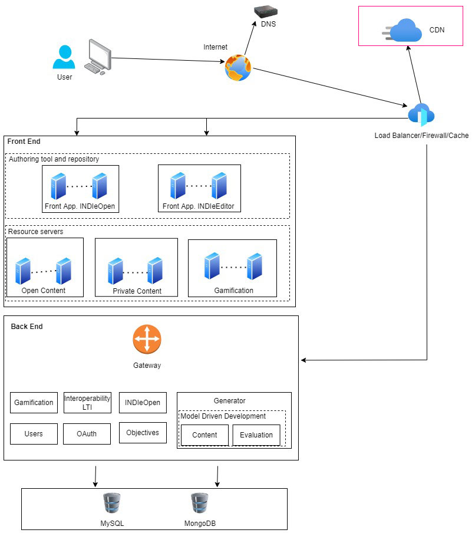

# CDN - INDIeOpen

This is the repository for one of the components of the INDIeOpen architecture, that was created during the projects INDIe (2018-1-ES01-KA201-050924) and INDIe4All (2020-1-ES01-KA201-083177), co-funded by the Erasmus+ Programme of the European Union. INDIe (http://indieproject.eu).

## INDIeOpen Architecture

## Deployment

The deployment of this Content Delivery Network (CDN) depends on the selected cloud computing provider. Each cloud computing provider provides its own deployment manual. In the case of Microsoft’s Azure one option is Azure Content Delivery Network (https://azure.microsoft.com/es-es/products/cdn/). You can find more information at the following URL: https://docs.microsoft.com/es-es/azure/frontdoor/.

## Creators and contributors

CDN files have been created at the **Digital Content Creation Center** (CPCD), in the Universidad Politécnica de Cartagena.

## License

Affero General Public License 3.0 (AGPL-3.0)

#### The European Commission support for the production of this publication does not constitute an endorsement of the contents which reflects the views only of the authors, and the Commission cannot be held responsible for any use which may be made of the information contained therein.
